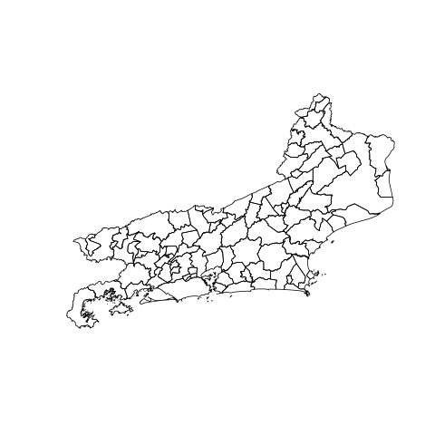
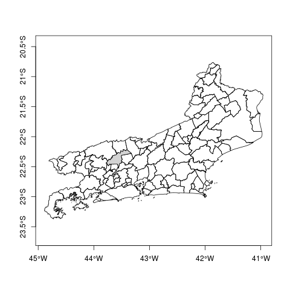

# shapefile
Shapefile é um dos vários tipode de dados geográficos do tipo vetorial.

```{r}
# Fazendo download de um dado geográfico
#Limite municipio Rio de Janeiro
download.file("http://servicodados.ibge.gov.br/Download/Download.ashx?u=geoftp.ibge.gov.br/cartas_e_mapas/bases_cartograficas_continuas/bc25/rj/versao2016/shapefile/lim.zip", "./dados/lim.zip")
```

Há diferentes pacotes usados para carregar e/ou salvar dados geográficos espaciais tipo shapefile, além, claro, de vários outros para realizar análises gepgráficas.

Vamos ao principal pacote para leitura dos dados: RGDAL [Geospatial Data Abstraction Library](http://www.gdal.org/)
```
install.packages(rgdal)
library(rgdal)
MunicipiosRJ <- readOGR(dsn = "./dados/lim", layer = "LIM_Municipio_A") #Perceba que deve-se informar o path ao arquivo shp separado do nome do arquivo e este ultimo, deve ser informado omitindo a extensão (".shp")
```
```
OGR data source with driver: ESRI Shapefile 
Source: "./dados/lim", layer: "LIM_Municipio_A"
with 92 features
It has 6 fields
Integer64 fields read as strings:  ANODEREFER 
Warning message:
In readOGR(dsn = "./dados/lim", layer = "LIM_Municipio_A") :
  Z-dimension discarded
```
Como pode-se ver pela mensagem da função *readOGR()*, o dado carregado ao objeto `MunicipiosRJ` possui 92 feições (ou registros, ou linhas) e seis colunas (ou campos); Isso de deve à natureza dos dados geográficos vetoriais que, além de suas feições geográficas (ou geometrias), podem ter associados tabulares. Podemos visualizar e acessar tais dados pela estrutura *@data*. Para exemplificar, vamos usar as funções báricas do R: *head()* e *tail*.
```{r}
head(limiteRJ@data)
```
```
  ID_OBJETO               NOME NOMEABREV GEOMETRIAA GEOCODIGO ANODEREFER
0        93     Angra dos Reis      <NA>        Sim   3300100       2016
1        94            Aperibé      <NA>        Sim   3300159       2016
2        95           Araruama      <NA>        Sim   3300209       2016
3        96              Areal      <NA>        Sim   3300225       2016
4        97 Armação dos Búzios      <NA>        Sim   3300233       2016
5        98    Arraial do Cabo      <NA>        Sim   3300258       2016
```
```{r}
tail(limiteRJ@data)
```
```
   ID_OBJETO              NOME NOMEABREV GEOMETRIAA GEOCODIGO ANODEREFER
86       179 Trajano de Morais      <NA>        Sim   3305901       2016
87       180         Três Rios      <NA>        Sim   3306008       2016
88       181           Valença      <NA>        Sim   3306107       2016
89       182         Varre_Sai      <NA>        Sim   3306156       2016
90       183         Vassouras      <NA>        Sim   3306206       2016
91       184     Volta Redonda      <NA>        Sim   3306305       2016
```
Dessa forma podemos ver que cada feição geográfica possui atributos associados em um tabela. No dado em questão, temos ID de cada município pertencente ao estado do Rio de Janeiro, seu nome e etc. Mas poderíamos ter outras informações, como por exemplo a taxa populacional, área do município, região a que pertence, etc.

Para produzir um mapa (ou visualizar a feição geográfica do objeto), não tem mistério. a propria função `plot()` faz isso.

```{r}
plot(limiteRJ)
```



Caso queira adicionar as coordenadas à visualização, basta adicionar oparametro `axes = TRUE` à função `plot()`.
```{r}
plot(limiteRJ, axes=T)
```


Outro ponto importante de notar é que o objeto que possui do dado geográfico vetorial carregado, respeita a mesma "estrutura" das clases matriciais e *data.frame*: Pode-se acessar cada feição pelo primeiro campo dentro dos colchetes e antes da virgula, ao passo que o atributo, ou acoluna, pode ser acessada no segundo campo dentro dos colchetes e depois da vergula. Dessa forma, poderíamos, por exemplo ressaltar um determinado municipio em nosso mapa. Para este exemplo, vamos ressaltar o município que consta como a feição 91 (ou, está na nonagésima primeira linha):

```{r}
plot(limiteRJ, axes = T)
plot(limiteRJ[91, ], col = "lightgrey", add=T)
```


